# 건축물 데이터 구축과정

## CONTENTS

#### Ⅰ. 데이터 개요

#### Ⅱ. 데이터 구축과정

#### Ⅲ. 데이터 결합 결과

#### Ⅳ. 연면적 계산과정

## Ⅰ.데이터 개요

#### 1. 건축물 통합정보 마스터(국토교통부)

- 연속수치지형도(수치지형도2.0의 건물레이어)의 건물공간정보와 건축행정시스템(세움터)의 건축물대장 속성정보를 건물단위로 통합하여 구축한 공간(토지)기반의 건물통합정보

- 데이터의 개수는 많지만 빈 속성이 많음

#### 2. 건물(국토지리정보원)

- 국토지리정보원 연속수치지형도 건물 데이터
- 표제부와 결합할 key가 없고 들어있는 속성이 적음

#### 3. 도로명주소 건물(행정안전부)

- 건축물의 사용승인 전 도로명주소 부여를 위해 생성되는 건물정보
- 속성에 건물의 고유번호 컬럼이 있지만, 표제부와 결합시 다른 속성정보를 불러옴(행정안전부의 건물 고유번호와 국토교통부의 건물 고유번호가 상이)
- 연면적, 높이 등의 속성정보가 없음

#### 4. GIS건물통합정보(국토교통부 - 공간정보제도과)

- 연속지적도 도형정보를 기반으로 건물 공간정보와 건축행정시스템(세움터)의 건축물 대장 속성정보를 건물단위로 통합하여 구축한 공간(토지)기반의 건물 통합정보
- 표제부와 결합할 key가 없고 속성정보가 적음

#### 5. GIS건물정보(국토교통부 - 국가공간정보센터)

- 건축물대장과 GIS건물통합정보의 건물을 융복합하여 생성한 공간정보
- 표제부와 결합할 key가 있고 다른 데이터에 비해 비교적 많은 속성 정보를 담고있음

## 데이터 개요 - 데이터 선정과정

### 도로명주소 건물

- 표제부의 제공기관은 국토교통부이고, 도로명주소 건물의 제공기관은 행정안전부로 다름
- 두 기관의 데이터를 결합하여 다양한 속성정보의 수집을 목표로 결합을 시도함
- 두 데이터의 PK번호(건물의 고유번호), PNU코드(필지의 고유번호), 건물명과 동이름 등으로 결합을 시도하여 대전광역시 기준 약 92%의 매칭을 성공하였으나, 행정안전부가 관리하는 PK번호와 국토교통부의 PK번호가 상이한것을 확인

< 도로명주소 건물 데이터 정보 >

|                  |                                      |
| :--------------: | :----------------------------------: |
|    데이터셋명    |            도로명주소건물            |
|    데이터유형    |                 공간                 |
|     제공기관     |              행정안전부              |
|     갱신주기     |                 매월                 |
|   최종갱신시기   |              2022년 8월              |
|     구출범위     |                 전국                 |
|  데이터 좌표계   |              GRS80중부               |
|   데이터 포맷    |                 SHP                  |
| 데이터 출처 링크 | http://data.nsdi.go.kr/dataset/14783 |

### 데이터 개요 - 선정 데이터

도로명주소 건물 데이터 정보의 PK번호 상이문제로 인해 다음과 같은 데이터를 선정함

#### 1. GIS건물 일반공간정보, GIS건물 집합공간정보

- 데이터셋명 : GIS건물일반공간정보, GIS건물집합공간정보
- 데이터유형 : 공간
- 제공기관 : 국토교통부 국가공간정보센터
- 갱신주기 : 분기
- 최종갱신시기 : 2022년 7월
- 구축범위 : 전국
- 데이터 좌표계 : Bessel/TM, EPSG:5174
- 데이터 포맷 : SHP
- 데이터 출처  링크 : http://openapi.nsdi.go.kr/nsdi/eios/ServiceDetail.dosvcSe=F&svcId=F018

※ GIS건물 일반공간정보 : 일반 건축물의 정보를 제공 
※ GIS건물 집합공간정보 : 집합 건축물의 정보를 제공 
※ GIS건물정보 = 'GIS건물 일반공간정보 + GIS건물 집합공간정보'로 정의 후 데이터 구축

< 일반건축물(초록)과 집합건축물(분홍) >

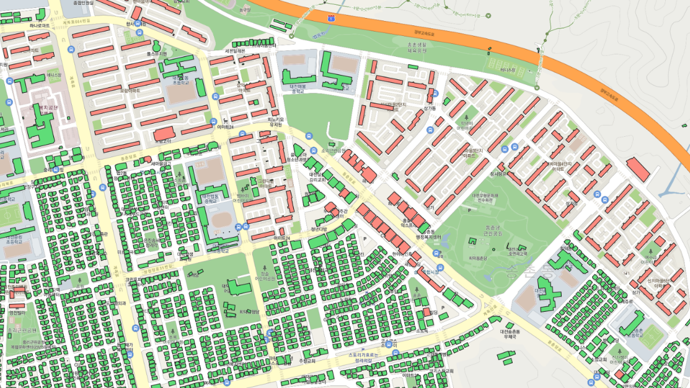

 

< GIS건물정보 이미지 >

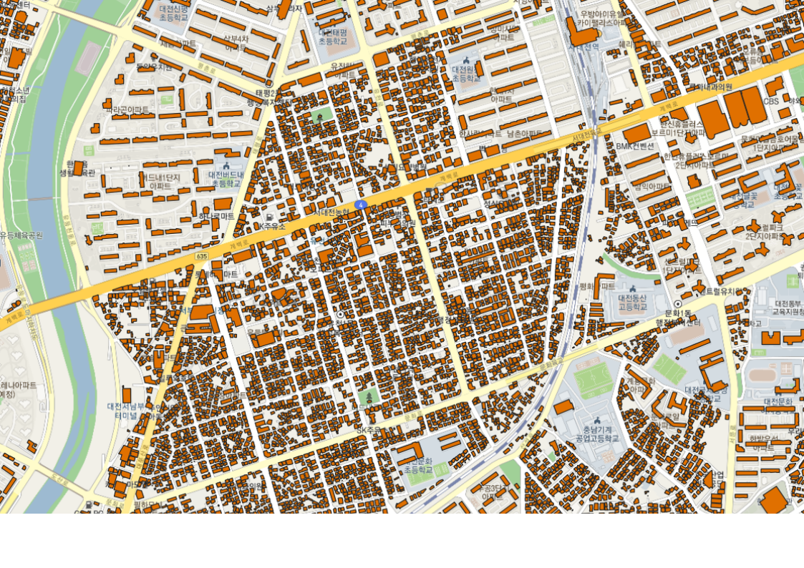

< GIS건물정보 메타데이터 >

 

#### 2. 건축물 대장 - 표제부

- 데이터셋명 : 건축물대장 -표제부
- 데이터유형 : 테이블
- 제공기관 : 국토교통부 녹색건축과
- 갱신주기 : 매월
- 최종갱신시기 : 2022년 7월
- 구축범위 : 전국
- 데이터 포맷 : TXT
- 구분자 : 파이프
- 데이터 출처 링크 : https://open.eais.go.kr/main/main.do

< 표제부 데이터 >

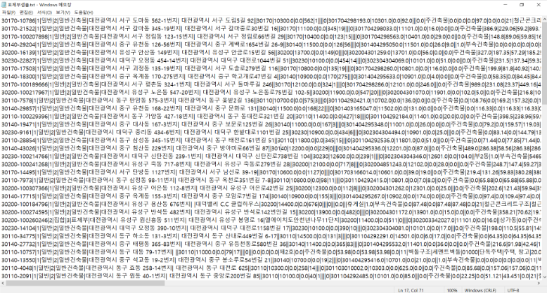

 

< 표제부 메타데이터 >

## Ⅱ. 데이터 구축과정

### 1차 데이터 구축 - PK번호를 이용한 결합

#### 데이터 확인

- SHP파일(GIS건물정보)에 'PK'값을 기준으로 중복값이 발생
- 확인결과 도형의 위치가 동일하게 중첩되어 있거나 살짝 어긋남
- 'PK’값을 기준으로 고유값인 데이터 추출
- 추가적으로 도형정보가 작은 원으로 생성된 오류 값 존재(아래 그림의 빨간 원)
- 이를 해결하기위해 면적이 1평(3.30578㎡)보다 작은 값을 추출해 도로명주소 건물 SHP파일에 공간조인

< GIS건물정보 데이터에서 잘못된 도형정보를 가진 값 >

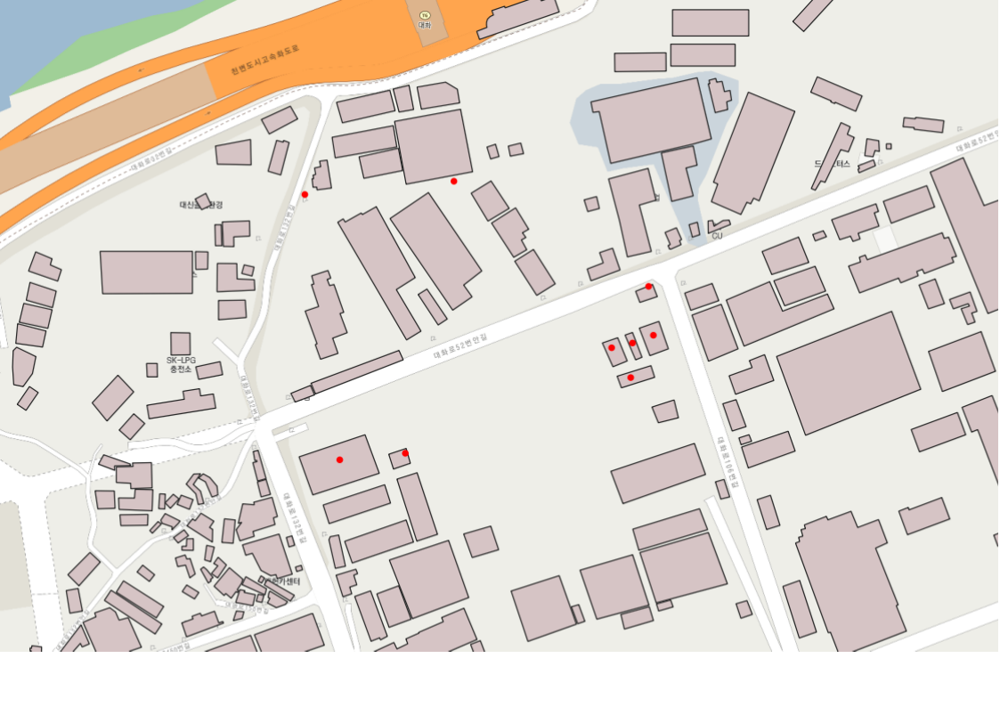

#### PK번호란?

- 개별 건축물 마다 부여되는 고유번호(서비스 제공자에게 별도 문의)
- '-'를 기준으로 앞에는 시군구번호, 뒤에는 건물일련번호로 구성
- 동일 건축물 층별 개요의 경우 PK 값이 모두 동일

#### 표제부 : PB_PK

- 표제부의 PB*PK(관리*건축물대장\_PK)는 개별 건물마다 부여된 고유번호
- 표제부의 총 개수 7,909,962개(PK번호 고유값 7,909,962개)

#### GIS건물정보 : 'PK'컬럼 생성

- GIS건물정보 데이터에는 PK번호 컬럼은 없지만 시군구코드와 건물식별번호 컬럼이 존재
- GIS건물정보['PK'] = 시군구코드 + "-" + 건물식별번호

< 표제부 PK번호 샘플 >

|    PB_PK    |
| :---------: |
| 27710-16411 |
| 28710-29345 |
| 28710-22947 |
| 28710-28233 |
| 31110-22063 |
| 46810-8204  |

#### 1차 결합과정

- GIS건물정보에 새로 만든 'PK'컬럼과 표제부의 ‘PB_PK'컬럼을 key값으로 설정
- Python코드를 이용하여 key값을 기준으로 두 개의 데이터 결합

#### 1차 결합 결과

- GIS건물정보 기준 대전광역시 전체 111,907개 中 110,756개 결합 성공, 1,151개 결합 실패
- GIS건물정보 기준 약 98.9% 결합
- 결합에 성공한 데이터와 실패한 데이터 분류

### 2차 데이터구축 - PNU를 이용한 결합

#### PNU란?

- Parcel Number의 약자로 필지의 고유번호를 뜻함
- 쉽게 말해 땅의 주민번호
- 시군구코드, 법정동코드, 대지구분코드, 본번, 부번으로 구성된 19자리의 숫자
- 하나의 필지에 여러 개의 건축물이 존재할 수 있음
- 이 경우 결합할 때 데이터가 중복적으로 결합돼 오류 발생
- 한 필지에 하나의 건축물이 있는 경우만 추출해 결합

< PNU 코드의 구성 >

 

< 한 필지에 여러개의 건물이 있는 경우 >

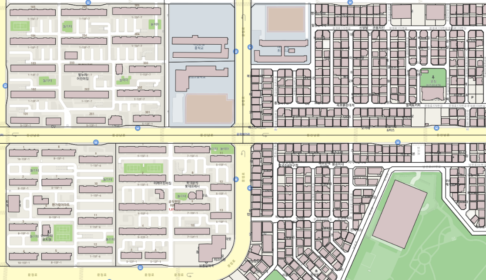

 

#### 표제부 : 'PYO PNU'컬럼 생성

- 표제부['PYO PNU'] = 시군구코드 + 법정동코드 + (대지구분코드 + 1) + 본번 + 부번

#### GIS건물정보 : 'A2'컬럼 사용

- GIS건물정보의 'A2'는 개별 건축물의 필지를 서로 구별하기 위하여 필지마다 붙이는 고유한 번호(=PNU코드)속성을 가지는 컬럼

#### 2차 결합과정

- 표제부 데이터에서 PNU코드가 고유값인 데이터 추출
- GIS건물정보의 'A2' 표제부의 'PNU'컬럼을 key값으로 설정
- Python코드를 이용하여 key값을 기준으로 두 개의 데이터 결합

#### 2차 결합 결과

- 1차 결합과정에서 실패한 데이터 1,151개 中  61개 결합성공, 1,090개 결합 실패
- 도로명주소 건물 기준 약 99% 결합 성공
- PNU코드는 생성됐지만 같은 필지에 여러 개의 건축물이 있어 결합을 하지못함

### 3차 데이터 구축 - PNU를 이용한 결합

#### PNU에 동이름을 붙여 고유값을 늘림

- 아파트의 경우 한 필지(동일한 PNU)에 여러 개의 건물이 존재하기에 고유값 추출 시 모두 누락
- PNU코드에 추가적으로 동이름을 붙여 재시도
- 동이름이 nan값인 필드는 0으로 치환해서 결합

#### 표제부 : 'PYO PNU D'컬럼 생성

- 표제부['P PNU D'] = 시군구코드 + 법정동코드 + 대지구분코드 + 본번 + 부번 + " " + 동이름

####  GIS건물정보 : 'A2 D'컬럼 생성

- GIS건물정보['A2 D'] = 필지고유번호('A2') + " " + 동이름('A19)

#### 3차 결합과정

- 표제부 데이터에서 PNU_D코드가 고유값인 행만 추출
- 표제부의 'PNU D'컬럼과 GIS건물정보의 'A2 D'컬럼을 key값으로 설정
- Python 코드로 두 데이터의 key값을 이용해 데이터 결합

#### 3차 결합 결과

- 2차 결합과정에서 실패한 데이터 1,090개 中  0개 결합성공, 1,090개 결합 실패
- 도로명주소 건물 기준 약 99% 결합 성공
- 대전광역시 전체 111,907개에서 110,817개 결합, 1,090개 실패

## Ⅲ. 데이터 결합 결과

### 도로명주소 건물과 표제부 결합 결과

- 도로명주소 건물 데이터와 표제부 데이터를 결합한 결과 99%(110,817개)의 데이터가 결합에 성공하였고 1%(1,090개)가 결합에 실패하였음

< 도로명주소 건물과 표제부 결합결과 >

#### 결합 오류 원인

- 결합 오류 데이터 확인결과 대부분 재개발, 재건축 지역으로 확인됨
- 표제부 데이터에서는 재개발, 재건축 건물이 반영되어있지만 GIS건물정보 데이터는 재개발, 재건축의 정보를 반영하지 않아 결합에 실패
- 그 외 결합되지 않은 데이터는 건물이 철거되었거나 원천 데이터 수집과정에서 누락된 데이터

< 결합오류 공간데이터 >

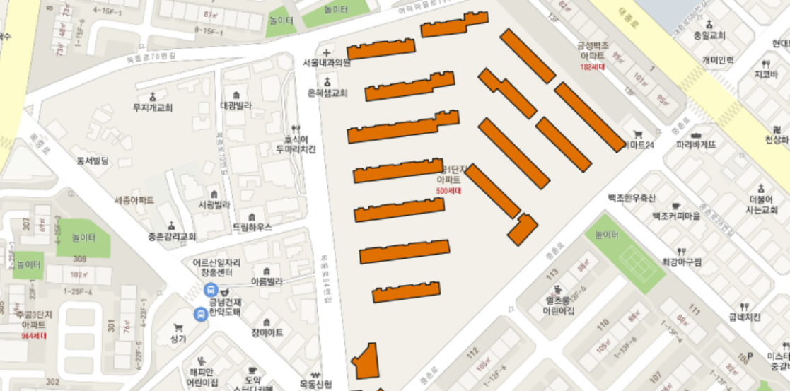

 

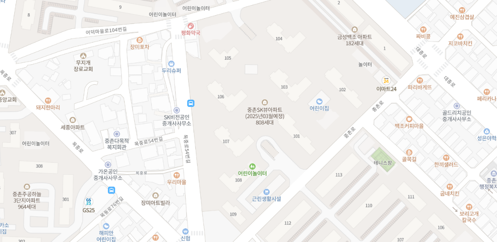

#### 결합 데이터 확인

- 아래 그림은 데이터 결합의 결과임
- 대전지역을 대상으로 순서대로 대전광역시청 주변 재개발 지역, 유성구 내 대학교(충남대, 카이스트), 대전 정부청사, 대전 제1일반산업단지이다.

< 대전광역시청 주변 재개발 지역 >

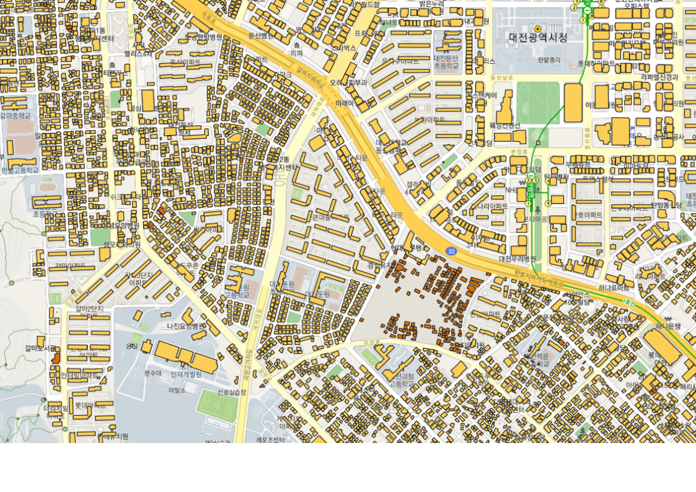

< 유성구 대학교(충남대, 카이스트) >

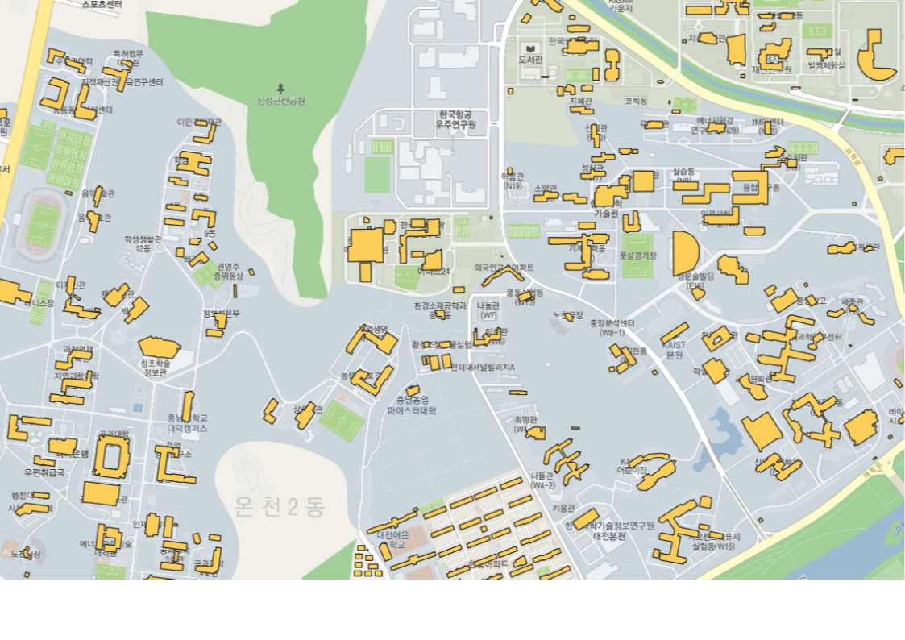

< 대전 정부청사 >

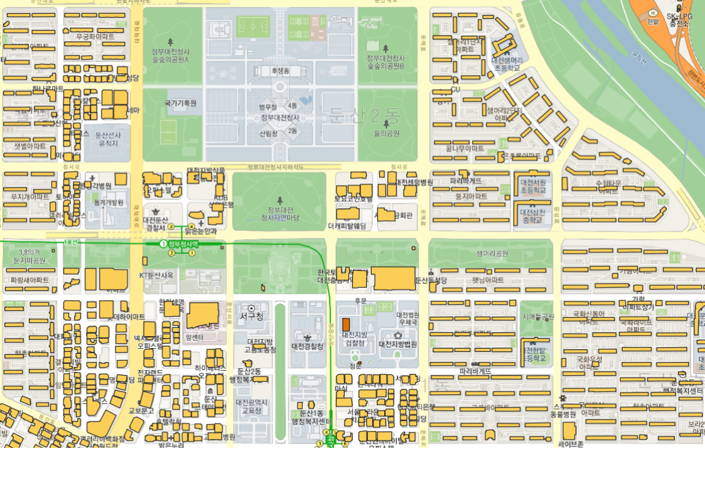

< 대전 제1일반산업단지 >

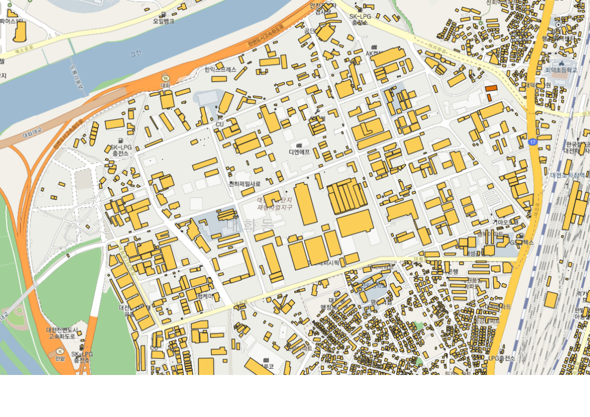

## Ⅳ. 연면적 계산과정

#### 1. 결합한 표제부의 연면적 사용

- '연면적' 컬럼 값이 없으면 결함한 표제부의 'TOTAREA' 컬럼으로 치환

#### 2. 결합한 표제부의 '용적률 산정 연면적' 사용

- '연면적'컬럼 값이 없으면 결합한 표제부의 ‘V_TOTAREA'컬럼으로 치환

#### 3. 용적률과 대지면적을 사용

- 연면적 = 용적률 \* 대지면적

#### 4. 바닥면적과 층수를 사용

- 바닥면적이 결측값이면 geopandas의 area함수를 이용하여 계산
- 층수 = 지상층수 + 지하층수
- 층수가 결측값이면 높이 값을 이용(층수 = trunc(높이 / 3))
- 연면적 = 바닥면적 \* 층수

### 연면적 계산 결과

- 연면적이 없는 값 1,482개 中 69개 계산성공
- 전체 110,817개 中 109,404개 연면적 값 존재
- 연면적 확인결과 과도하게 큰 수치는 수작업으로 수정 필요

