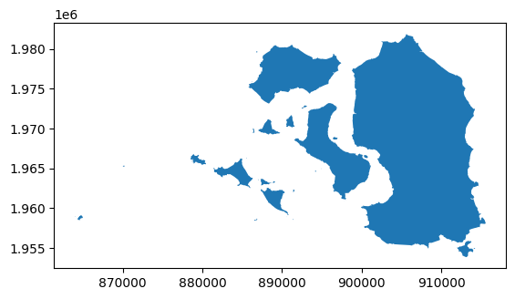
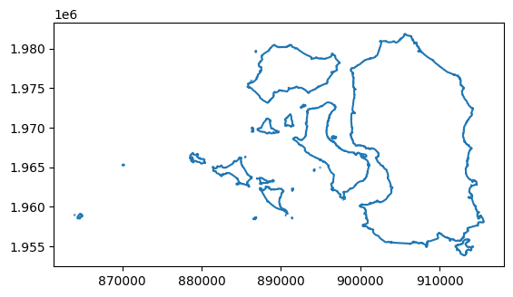
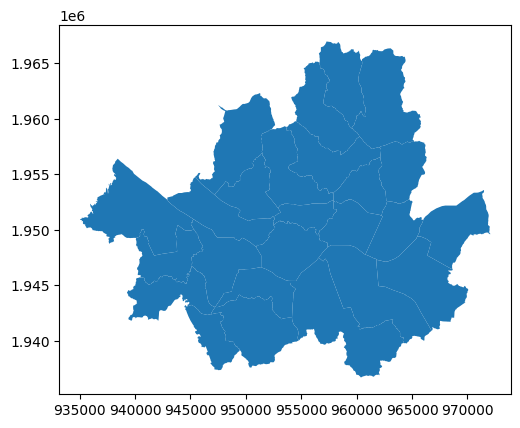
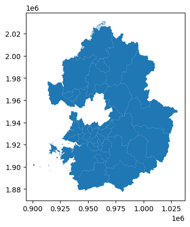
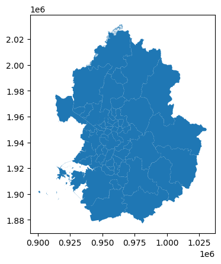

# Geopandas 기능정리

```python
import pandas as pd
import geopandas as gpd
import matplotlib.pyplot as plt
pd.options.display.float_format = '{:.5f}'.format

```

# geopandas.GeoSeries.area

## Definition 정의

- ### 각 기하 도형의 면적 값을 반환한다.

## Note

- ### Line이나 Point는 면적을 계산할 수 없기에 0을 반환한다.
- ### geopandas의 모든 작업은 평면적이며 3차원은 계산되지 않는다.

## How to use it

- ### 시군구의 면적을 알 수 있다.
- ### 건축물 데이터로 개별 건축물의 바닥면적을 구할 수 있다.

## Example

```python
gdf = gpd.read_file('D:/data/SIG_20220324/sig.shp', encoding = 'euc-kr') # 전국 시군구 SHP파일
gdf['area']= gdf.area
gdf
```

<div>
<style scoped>
    .dataframe tbody tr th:only-of-type {
        vertical-align: middle;
    }

    .dataframe tbody tr th {
        vertical-align: top;
    }

    .dataframe thead th {
        text-align: right;
    }

</style>
<table border="1" class="dataframe">
  <thead>
    <tr style="text-align: right;">
      <th></th>
      <th>SIG_CD</th>
      <th>SIG_ENG_NM</th>
      <th>SIG_KOR_NM</th>
      <th>geometry</th>
      <th>area</th>
    </tr>
  </thead>
  <tbody>
    <tr>
      <th>0</th>
      <td>11110</td>
      <td>Jongno-gu</td>
      <td>종로구</td>
      <td>POLYGON ((956615.453 1953567.199, 956621.579 1...</td>
      <td>23971611.81458</td>
    </tr>
    <tr>
      <th>1</th>
      <td>11140</td>
      <td>Jung-gu</td>
      <td>중구</td>
      <td>POLYGON ((957890.386 1952616.746, 957909.908 1...</td>
      <td>9962768.31718</td>
    </tr>
    <tr>
      <th>2</th>
      <td>11170</td>
      <td>Yongsan-gu</td>
      <td>용산구</td>
      <td>POLYGON ((953115.761 1950834.084, 953114.206 1...</td>
      <td>21897558.89459</td>
    </tr>
    <tr>
      <th>3</th>
      <td>11200</td>
      <td>Seongdong-gu</td>
      <td>성동구</td>
      <td>POLYGON ((959681.109 1952649.605, 959842.412 1...</td>
      <td>16800779.55362</td>
    </tr>
    <tr>
      <th>4</th>
      <td>11215</td>
      <td>Gwangjin-gu</td>
      <td>광진구</td>
      <td>POLYGON ((964825.058 1952633.250, 964875.565 1...</td>
      <td>17028811.48831</td>
    </tr>
    <tr>
      <th>...</th>
      <td>...</td>
      <td>...</td>
      <td>...</td>
      <td>...</td>
      <td>...</td>
    </tr>
    <tr>
      <th>245</th>
      <td>48870</td>
      <td>Hamyang-gun</td>
      <td>함양군</td>
      <td>POLYGON ((1017715.723 1751280.191, 1017761.619...</td>
      <td>720434916.29598</td>
    </tr>
    <tr>
      <th>246</th>
      <td>48880</td>
      <td>Geochang-gun</td>
      <td>거창군</td>
      <td>POLYGON ((1034571.593 1767759.812, 1034559.208...</td>
      <td>798894760.10270</td>
    </tr>
    <tr>
      <th>247</th>
      <td>48890</td>
      <td>Hapcheon-gun</td>
      <td>합천군</td>
      <td>POLYGON ((1054066.576 1759517.415, 1054101.450...</td>
      <td>983099850.84470</td>
    </tr>
    <tr>
      <th>248</th>
      <td>50110</td>
      <td>Jeju-si</td>
      <td>제주시</td>
      <td>MULTIPOLYGON (((874410.953 1480515.382, 874408...</td>
      <td>976851092.81553</td>
    </tr>
    <tr>
      <th>249</th>
      <td>50130</td>
      <td>Seogwipo-si</td>
      <td>서귀포시</td>
      <td>MULTIPOLYGON (((885004.560 1458756.461, 884996...</td>
      <td>868696549.61268</td>
    </tr>
  </tbody>
</table>
<p>250 rows × 5 columns</p>
</div>

# geopandas.GeoSeries.boundary

## Definition

- ### 각 기하 도형의 외부경계(=테두리)를 객체로 반환한다.

## Note

- ### polygon의 경우 외부경계를 반환한다.
- ### point는 둘레가 없기에 0을 반환한다.
- ### multipolygon의 경우 모든 단일 polygon마다 테두리를 반환한다.

## How to use it

- ### 시군구 SHP파일에서 경계를 추출할 수 있다.

## Examples

```python
gdf = gpd.read_file('D:/data/SIG_20220324/강화군.shp', encoding = 'euc-kr') # 강화군 SHP파일
gdf.plot()
gdf_boun = gdf.boundary
gdf_boun.plot()
```

    <AxesSubplot:>





# geopandas.GeoSeries.bounds

## Definition

- ### 각 기하 도형에서 좌표의 최소, 최대값을 반환한다.

## Note

- ### DataFrame형식으로 반환한다.
- ### 반환하는 컬럼은 minx, miny, maxx, maxy이다.

## How to use it

- ### SHP파일 개별 필드마다 좌표의 최소, 최대값을 살펴볼 수 있다.
- ### 충주시에서 가장 북쪽에 있는 좌표를 알 수 있다.

## Examples

```python
gdf = gpd.read_file('D:/data/SIG_20220324/강화군.shp', encoding = 'euc-kr') # 강화군 SHP파일
gdf.bounds
```

<div>
<style scoped>
    .dataframe tbody tr th:only-of-type {
        vertical-align: middle;
    }

    .dataframe tbody tr th {
        vertical-align: top;
    }

    .dataframe thead th {
        text-align: right;
    }

</style>
<table border="1" class="dataframe">
  <thead>
    <tr style="text-align: right;">
      <th></th>
      <th>minx</th>
      <th>miny</th>
      <th>maxx</th>
      <th>maxy</th>
    </tr>
  </thead>
  <tbody>
    <tr>
      <th>0</th>
      <td>863982.51856</td>
      <td>1953854.17180</td>
      <td>915596.01733</td>
      <td>1981861.00792</td>
    </tr>
  </tbody>
</table>
</div>

# geopandas.GeoDataFrame.overlay

## Definition

- ### 공간적으로 겹치는(또는 겹치지 않는) 도형을 반환한다.

## Note

- ### 합집합, 차집합, 교집합 등의 공간 연산 기능을 제공한다.
- ### GeoDataFrame안에서 동일한 기하 유형을 가진 형식만 지원된다.

## Parameters

- ### how : 공간 중첩 방법(‘intersection’, ‘union’, ‘identity’, ‘symmetric_difference’, ‘difference’)을 선택한다.
- ### keep_geom_type : 값을 True로 설정하면 GeoDataFrame과 동일한 도형의 유형만 반환하고 False면 모든 도형의 유형을 반환한다.
- ### make_valid : 값을 True로 설정하면 오류 발생 시 기하도형이 buffer(0)에 대한 값으로 수정되어 연산되고, False면 오류가 발생시 ValueError가 호출된다.

## How to use it

- ### 여러 개의 지역 SHP파일을 합칠 수 있다.
- ### 서울시에서 버스정류장 반경 500m안에 들어오지 않는 지역을 추출할 수 있다.

## Examples

```python
gdf = gpd.read_file('D:/data/SIG_20220324/서울특별시.shp', encoding = 'euc-kr') # 서울특별실 SHP파일
gdf.plot()
gdf2 = gpd.read_file('D:/data/SIG_20220324/경기도.shp', encoding = 'euc-kr') # 경기도 SHP파일
gdf2.plot()
gdf_overlay = gpd.overlay(gdf, gdf2, how='union',keep_geom_type=False)
gdf_overlay.plot()
```

    <AxesSubplot:>






